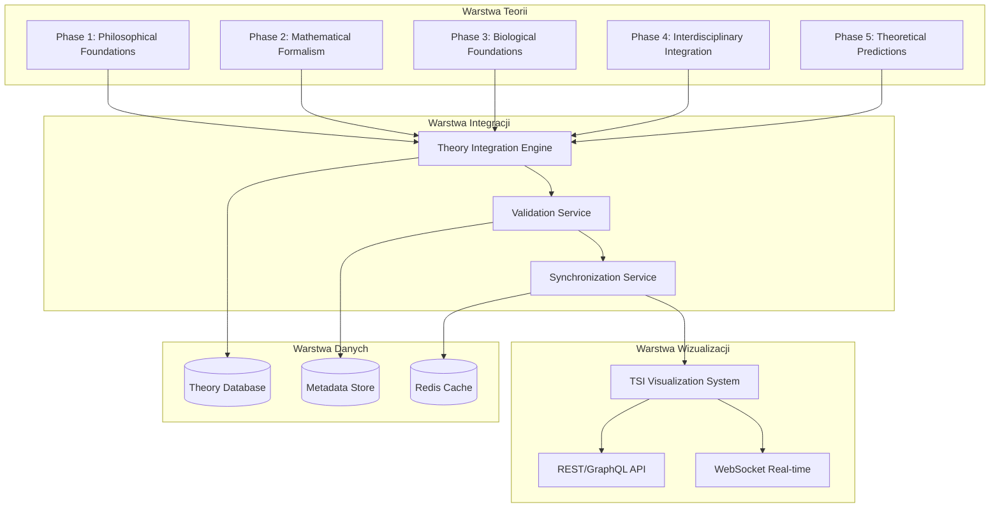
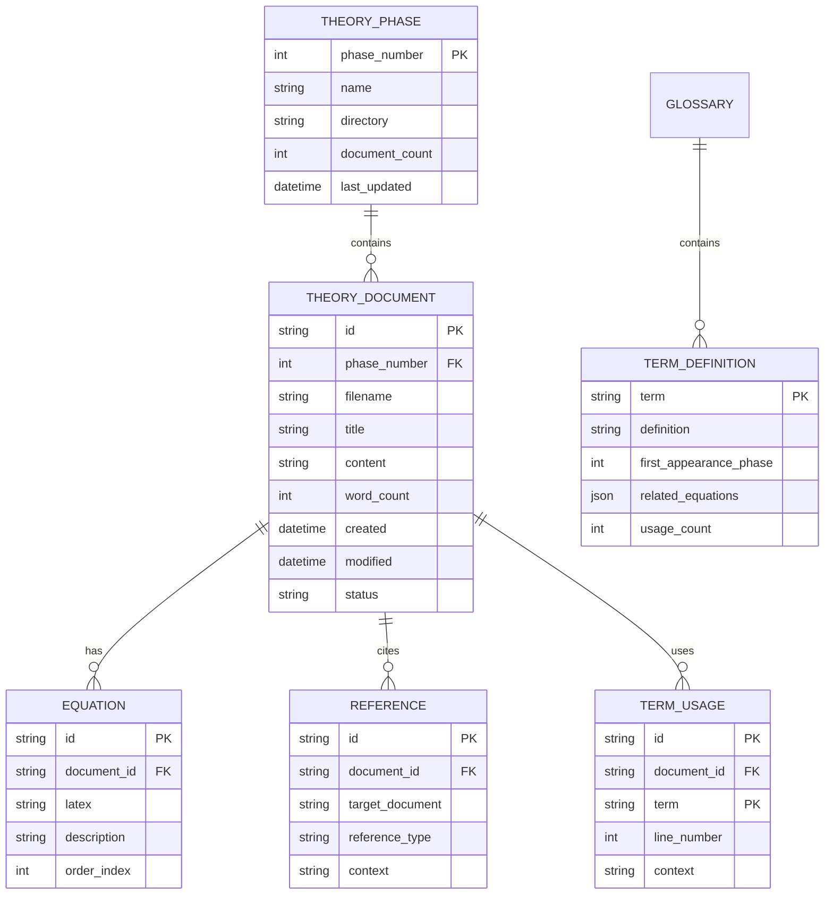
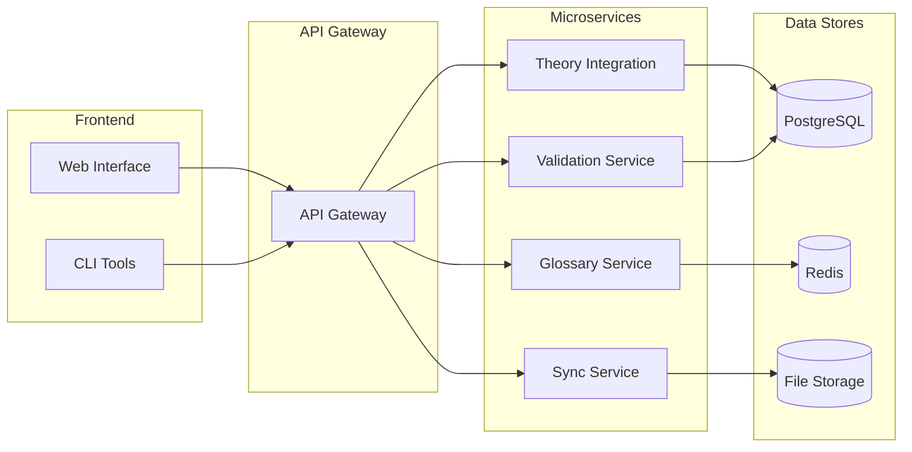

# 🏗️ Specyfikacja Architektury Integracji TSI 8.0

## 1. Diagram Integracji Teorii z Systemem



## 2. Interfejsy API dla Integracji Teorii

### 2.1 Theory Integration API
```typescript
interface TheoryIntegrationService {
  // Ładowanie teorii z plików markdown
  loadTheory(phase: number, filePath: string): Promise<TheoryDocument>;
  
  // Walidacja spójności między fazami
  validateConsistency(phase1: number, phase2: number): Promise<ValidationResult>;
  
  // Aktualizacja referencji po przeniesieniu plików
  updateReferences(oldPath: string, newPath: string): Promise<void>;
  
  // Generowanie spisu treści
  generateTableOfContents(): Promise<TOC>;
}

interface TheoryDocument {
  id: string;
  phase: number;
  title: string;
  content: string;
  metadata: {
    wordCount: number;
    equations: string[];
    references: string[];
    lastModified: Date;
  };
  validation: {
    isValid: boolean;
    errors: ValidationError[];
    warnings: string[];
  };
}
```

### 2.2 Glossary Management API
```typescript
interface GlossaryService {
  // Dodawanie terminów do słownika
  addTerm(term: string, definition: string, phase: number): Promise<void>;
  
  // Wyszukiwanie terminów
  searchTerms(query: string): Promise<TermDefinition[]>;
  
  // Walidacja użytych terminów w dokumencie
  validateTerms(content: string): Promise<TermValidation[]>;
  
  // Eksport słownika
  exportGlossary(format: 'json' | 'markdown'): Promise<string>;
}

interface TermDefinition {
  term: string;
  definition: string;
  phase: number;
  relatedTerms: string[];
  equations: string[];
  usage: string;
}
```

## 3. Schemat Danych dla Integracji



## 4. Plan Integracji - Krok po Kroku

### Faza 1: Przygotowanie Struktury (15 minut)
1. **Utworzenie serwisu integracji**
   - Utworzenie `TheoryIntegrationService`
   - Konfiguracja połączeń z bazą danych
   - Ustawienie monitoringu

2. **Migracja plików**
   - Przeniesienie `COMPLETE-MATHEMATICAL-UNIFICATION.md`
   - Aktualizacja wszystkich linków wewnętrznych
   - Walidacja ścieżek

### Faza 2: Uzupełnienie Treści (45 minut)
1. **docs/glossary.md** (300+ linii)
   - Pełny słownik terminów TSI 8.0
   - Definicje matematyczne i filozoficzne
   - Powiązania między fazami

2. **theory/core-concepts.md** (250+ linii)
   - Fundamentalne koncepcje teorii
   - Powiązania między fazami
   - Diagramy koncepcyjne

3. **theory/mathematical-formalism.md** (200+ linii)
   - Skrócony przegląd formalizmu
   - Kluczowe równania
   - Przykłady zastosowania

4. **theory/predictions.md** (300+ linii)
   - Przewidywania eksperymentalne
   - Metodologia testów
   - Kryteria falsyfikacji

### Faza 3: Walidacja i Integracja (30 minut)
1. **Walidacja spójności**
   - Sprawdzenie wszystkich referencji
   - Walidacja terminologii
   - Sprawdzenie matematycznej spójności

2. **Integracja z systemem wizualizacji**
   - Aktualizacja API endpoints
   - Synchronizacja danych
   - Testy end-to-end

## 5. Technologia i Narzędzia

### 5.1 Stack Technologiczny
- **Backend**: Node.js + TypeScript
- **Database**: PostgreSQL + Redis
- **API**: REST + GraphQL
- **Monitoring**: Prometheus + Grafana
- **CI/CD**: GitHub Actions

### 5.2 Narzędzia Deweloperskie
```json
{
  "scripts": {
    "integrate-theory": "npm run migrate-files && npm run validate-theory",
    "migrate-files": "node scripts/migrate-theory-files.js",
    "validate-theory": "node scripts/validate-theory.js",
    "generate-glossary": "node scripts/generate-glossary.js",
    "test-integration": "jest tests/integration/"
  }
}
```

## 6. Monitoring i Walidacja

### 6.1 Metryki Jakości
```typescript
interface QualityMetrics {
  consistency: {
    references: number;
    brokenLinks: number;
    consistencyScore: number;
  };
  completeness: {
    totalDocuments: number;
    completedDocuments: number;
    completionPercentage: number;
  };
  accuracy: {
    validatedEquations: number;
    totalEquations: number;
    validationScore: number;
  };
}
```

### 6.2 Automatyczne Testy
```typescript
describe('Theory Integration', () => {
  it('should validate all cross-references between phases', async () => {
    const validator = new TheoryValidator();
    const result = await validator.validateCrossReferences();
    expect(result.brokenReferences).toHaveLength(0);
  });
  
  it('should maintain glossary consistency across all phases', async () => {
    const glossary = new GlossaryService();
    const terms = await glossary.validateAllTerms();
    expect(terms.inconsistent).toHaveLength(0);
  });
});
```

## 7. Harmonogram Implementacji

| Czas | Zadanie | Status |
|------|---------|--------|
| 0-15 min | Przygotowanie struktury i migracja plików | 🔜 |
| 15-60 min | Uzupełnienie treści (4 pliki) | 🔜 |
| 60-90 min | Walidacja i integracja | 🔜 |
| 90-120 min | Testy i finalizacja | 🔜 |

## 8. Kryteria Akceptacji

- [ ] Wszystkie pliki teorii są kompletne (300+ linii każdy)
- [ ] Wszystkie referencje między fazami są aktualne
- [ ] Słownik terminów zawiera wszystkie kluczowe pojęcia
- [ ] System wizualizacji poprawnie integruje się z teorią
- [ ] Wszystkie testy przechodzą pomyślnie
- [ ] Dokumentacja jest aktualna i kompletna

## 9. Delegacja Zadań

### Do Code Mode:
- Implementacja `TheoryIntegrationService`
- Utworzenie skryptów migracji
- Implementacja walidacji referencji
- Utworzenie systemu glossary

### Do Debug Mode:
- Testy integracyjne
- Walidacja spójności danych
- Testy wydajnościowe
- Monitoring błędów

## 10. Architektura Mikroserwisów



Specyfikacja gotowa do implementacji. Czy zatwierdzasz tę architekturę?