# 📋 TSI 8.0 - SPECIFIKACJA TECHNICZNA SYSTEMU WIZUALIZACJI

## 🎯 Cel Dokumentu
Kompletna specyfikacja techniczna systemu wizualizacji teorii unifikacyjnej TSI 8.0, integrującej holograficzną projekcję z przestrzeni n-wymiarowej, biologiczną złożoność i mechanikę kwantową.

## 📐 Architektura Systemu

### 1. Diagram Architektury Całego Systemu


### 2. Diagram Przepływu Danych

```mermaid
flowchart TD
    subgraph "Data Sources"
        BIO[Biological Sensors<br/>EEG, fMRI, Metabolic]
        QUANTUM[Quantum Measurements<br/>Magnetometers, RNG]
        ENV[Environmental<br/>Temperature, EM Fields]
    end
    
    subgraph "Processing Pipeline"
        INGEST[Data Ingestion<br/>Kafka/Redis Streams]
        VALIDATE[Validation<br/>Zod Schemas]
        COMPUTE[Complexity Calculation<br/>M·E·I·C Product]
        PROJECT[Holographic Projection<br/>ℋⁿ → 𝕄⁴]
    end
    
    subgraph "Visualization"
        REALTIME[Real-time Updates<br/>WebSocket]
        HISTORICAL[Historical Analysis<br/>Time Series]
        PREDICT[Predictive Models<br/>ML/AI]
    end
    
    BIO --> INGEST
    QUANTUM --> INGEST
    ENV --> INGEST
    
    INGEST --> VALIDATE
    VALIDATE --> COMPUTE
    COMPUTE --> PROJECT
    
    PROJECT --> REALTIME
    PROJECT --> HISTORICAL
    HISTORICAL --> PREDICT
```



### 3. Model Danych - Diagram ERD


## 🔧 Specyfikacja Komponentów

### 1. Holographic Engine Service

#### 1.1 Interfejs API
```typescript
interface HolographicEngine {
  // Projektowanie z ℋⁿ do 𝕄⁴
  projectTo4D(field: HolographicField): ProjectedField;
  
  // Obliczanie korelacji holograficznych
  calculateCorrelation(
    field1: HolographicField,
    field2: HolographicField,
    distance: number
  ): CorrelationResult;
  
  // Symulacja ewolucji pola
  simulateEvolution(
    initialState: HolographicField,
    timeSteps: number,
    parameters: SimulationParameters
  ): EvolutionResult;
}

interface HolographicField {
  dimensions: number;
  fieldValues: number[][][];
  projectionMatrix: number[][];
  biologicalCoupling: BiologicalComplexity;
}

interface ProjectedField {
  fieldStrength: number[][];
  coordinates: number[][];
  timestamp: Date;
  dimensionality: number;
}
```

#### 1.2 Algorytm Projektowania
```python
class HolographicProjection:
    def __init__(self, dimensions: int = 6):
        self.n = dimensions
        self.projection_matrix = self._generate_projection_matrix()
    
    def project_to_4d(self, field_n: np.ndarray) -> np.ndarray:
        """Projekcja z ℋⁿ do 𝕄⁴"""
        # Operator projekcji Π: ℋⁿ → 𝕄⁴
        projected = np.tensordot(
            self.projection_matrix, 
            field_n, 
            axes=([1], [0])
        )
        return projected
    
    def calculate_correlation(self, r: float) -> float:
        """Korelacja zgodnie z C(r) ∝ r^(-(n-4)/2)"""
        exponent = -(self.n - 4) / 2
        return self.correlation_constant * (r ** exponent)
```

### 2. Biological Complexity Calculator

#### 2.1 Obliczanie M·E·I·C
```typescript
class BiologicalComplexityCalculator {
  calculateProduct(measurement: BiologicalMeasurement): ComplexityProduct {
    const M = measurement.metabolicRate / BASELINE_METABOLIC;
    const E = measurement.bioelectricField / BASELINE_ELECTRIC;
    const I = measurement.informationEntropy / MAX_ENTROPY;
    const C = Math.log(1 + measurement.connectivityIndex);
    
    return {
      metabolic: M,
      bioelectric: E,
      information: I,
      connectivity: C,
      product: M * E * I * C,
      consciousnessLevel: this.calculateConsciousnessLevel(M * E * I * C)
    };
  }
  
  private calculateConsciousnessLevel(product: number): number {
    // Γ_consciousness = tanh[(M·E·I·C - critical)/σ]
    const critical = 2.7;
    const sigma = 0.8;
    return Math.tanh((product - critical) / sigma);
  }
}
```

### 3. Quantum State Visualizer

#### 3.1 Renderowanie Stanów Kwantowych
```typescript
interface QuantumVisualizer {
  renderWavefunction(
    state: QuantumState,
    container: HTMLElement,
    options: RenderOptions
  ): void;
  
  animateInterference(
    pattern: InterferencePattern,
    duration: number
  ): Animation;
  
  updateRealTime(
    stream: Observable<QuantumState>
  ): Subscription;
}

class WebGLQuantumRenderer {
  private gl: WebGL2RenderingContext;
  private shaderProgram: WebGLProgram;
  
  constructor(canvas: HTMLCanvasElement) {
    this.gl = canvas.getContext('webgl2');
    this.initShaders();
  }
  
  renderWavefunction(amplitudes: ComplexNumber[][]) {
    const texture = this.createTexture(amplitudes);
    this.renderToCanvas(texture);
  }
}
```

## 📊 Specyfikacja Wydajności

### 1. Wymagania Systemowe

#### 1.1 Minimalne Wymagania
- **CPU**: 4 rdzenie, 2.5 GHz
- **RAM**: 8 GB
- **GPU**: WebGL2 compatible
- **Network**: 10 Mbps

#### 1.2 Zalecane Wymagania
- **CPU**: 8 rdzeni, 3.5 GHz
- **RAM**: 16 GB
- **GPU**: Dedicated GPU with 4GB VRAM
- **Network**: 100 Mbps

### 2. Metryki Wydajności

| Metryka | Cel | Granica |
|---------|-----|---------|
| FPS | 60 | >30 |
| Latencja API | <100ms | <500ms |
| Czas ładowania | <3s | <10s |
| Memory usage | <2GB | <4GB |
| CPU usage | <70% | <90% |

### 3. Skalowalność

#### 3.1 Horizontal Scaling
```yaml
holographic-engine:
  replicas: 3
  resources:
    requests:
      memory: "2Gi"
      cpu: "1000m"
    limits:
      memory: "4Gi"
      cpu: "2000m"
```

#### 3.2 Caching Strategy
- **L1**: Browser cache (static assets)
- **L2**: Redis cache (API responses)
- **L3**: CDN cache (global distribution)

## 🔐 Bezpieczeństwo

### 1. Autoryzacja i Uwierzytelnianie
```typescript
interface SecurityConfig {
  jwtSecret: string;
  tokenExpiry: string;
  refreshTokenExpiry: string;
  corsOrigins: string[];
  rateLimit: {
    windowMs: number;
    maxRequests: number;
  };
}
```

### 2. Walidacja Danych
```typescript
const holographicFieldSchema = z.object({
  dimensions: z.number().min(5).max(12),
  fieldValues: z.array(z.array(z.number())),
  projectionMatrix: z.array(z.array(z.number())),
  biologicalCoupling: z.object({
    metabolic: z.number().positive(),
    bioelectric: z.number().positive(),
    information: z.number().positive(),
    connectivity: z.number().positive()
  })
});
```

## 🚀 Deployment

### 1. Docker Configuration
```dockerfile
FROM node:20-alpine

WORKDIR /app
COPY package*.json ./
RUN npm ci --only=production

COPY . .
RUN npm run build

EXPOSE 3000
CMD ["npm", "start"]
```

### 2. Kubernetes Deployment
```yaml
apiVersion: apps/v1
kind: Deployment
metadata:
  name: tsi-holographic-engine
spec:
  replicas: 3
  selector:
    matchLabels:
      app: holographic-engine
  template:
    metadata:
      labels:
        app: holographic-engine
    spec:
      containers:
      - name: holographic-engine
        image: tsi/holographic-engine:latest
        ports:
        - containerPort: 3000
        env:
        - name: DIMENSIONS
          value: "6"
        - name: PROJECTION_MODE
          value: "auto"
```

### 3. Monitoring
```yaml
apiVersion: v1
kind: ServiceMonitor
metadata:
  name: tsi-monitoring
spec:
  selector:
    matchLabels:
      app: tsi-system
  endpoints:
  - port: metrics
    interval: 30s
    path: /metrics
```

## 📋 Testy i Walidacja

### 1. Testy Jednostkowe
```typescript
describe('HolographicProjection', () => {
  it('should project 6D field to 4D correctly', () => {
    const projector = new HolographicProjection(6);
    const field6D = generateTestField(6);
    const field4D = projector.projectTo4D(field6D);
    
    expect(field4D.dimensions).toBe(4);
    expect(field4D.fieldStrength).toBeDefined();
  });
});
```

### 2. Testy Integracyjne
```typescript
describe('Consciousness Threshold', () => {
  it('should activate at M·E·I·C = 2.7±0.5', async () => {
    const calculator = new BiologicalComplexityCalculator();
    const result = await calculator.calculateProduct(testMeasurement);
    
    expect(result.consciousnessLevel).toBeGreaterThan(0.5);
    expect(result.product).toBeCloseTo(2.7, 0.5);
  });
});
```

## 🔄 CI/CD Pipeline

### 1. GitHub Actions
```yaml
name: TSI 8.0 CI/CD

on:
  push:
    branches: [main, develop]
  pull_request:
    branches: [main]

jobs:
  test:
    runs-on: ubuntu-latest
    steps:
      - uses: actions/checkout@v4
      - uses: actions/setup-node@v4
        with:
          node-version: '20'
      - run: npm ci
      - run: npm run test
      - run: npm run build
```

## 📞 Kontakt i Wsparcie

### 1. Dokumentacja API
- **Swagger UI**: `https://api.tsi8.com/docs`
- **Postman Collection**: `https://api.tsi8.com/postman`

### 2. Support
- **Issues**: GitHub Issues
- **Discussions**: GitHub Discussions
- **Email**: support@tsi8.com

---

**Status Dokumentu**: Wersja 1.0 - Gotowa do implementacji  
**Data**: 27 lipca 2025  
**Autor**: TSI 8.0 Architecture Team