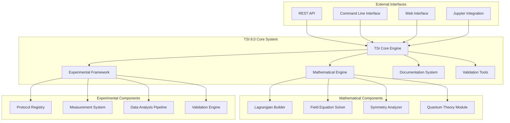
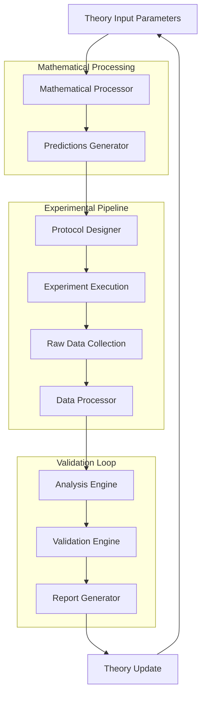
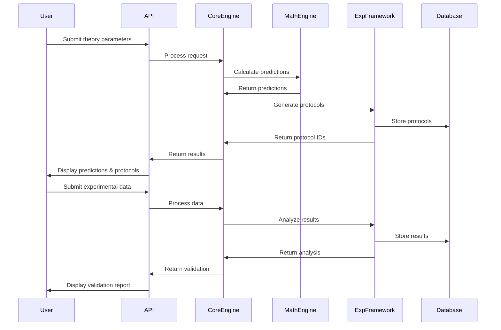
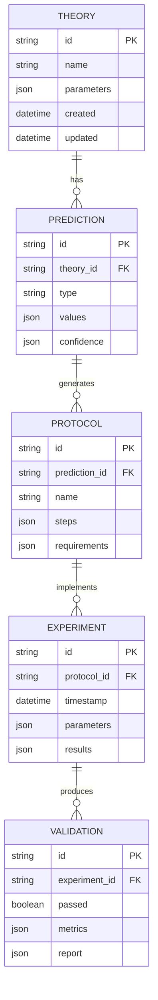
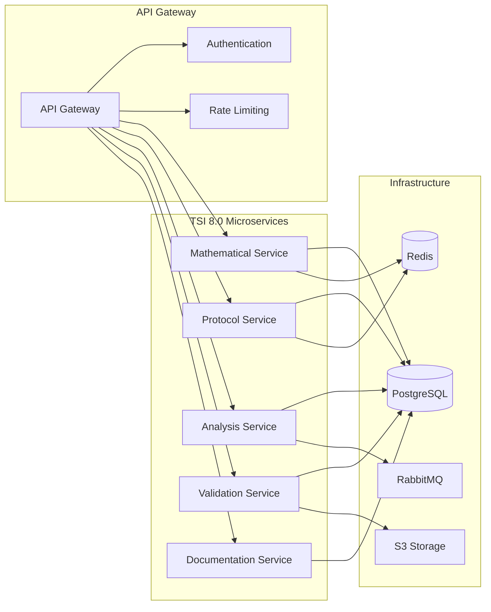
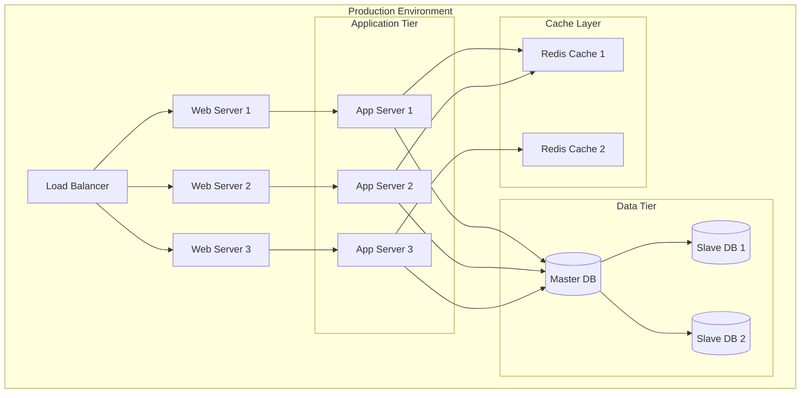

# 🏗️ TSI 8.0 System Architecture

## Overview
Complete system architecture for the Theory of Conscious Informational Determination (TSI 8.0) implementation.

## System Components

### 1. Core Architecture Diagram



### 2. Data Flow Architecture



### 3. Component Interaction Diagram



### 4. Database Schema



### 5. Microservices Architecture



### 6. Deployment Architecture



## Technology Stack

### Backend Services
- **Language**: Python 3.11+
- **Framework**: FastAPI
- **Database**: PostgreSQL 14+
- **Cache**: Redis
- **Queue**: RabbitMQ
- **Container**: Docker

### Frontend Services
- **Framework**: React 18+
- **State Management**: Redux Toolkit
- **UI Library**: Material-UI
- **Charts**: D3.js, Recharts
- **Build Tool**: Vite

### Infrastructure
- **Cloud**: AWS/GCP
- **Orchestration**: Kubernetes
- **CI/CD**: GitHub Actions
- **Monitoring**: Prometheus + Grafana
- **Logging**: ELK Stack

## API Specifications

### Core API Endpoints

```yaml
openapi: 3.0.0
info:
  title: TSI 8.0 API
  version: 1.0.0
paths:
  /theory/calculate:
    post:
      summary: Calculate theory predictions
      requestBody:
        content:
          application/json:
            schema:
              $ref: '#/components/schemas/TheoryParameters'
      responses:
        200:
          description: Predictions calculated successfully
          content:
            application/json:
              schema:
                $ref: '#/components/schemas/PredictionResult'
  
  /experiments/protocols:
    get:
      summary: List experimental protocols
      responses:
        200:
          description: List of protocols
          content:
            application/json:
              schema:
                type: array
                items:
                  $ref: '#/components/schemas/Protocol'
  
  /validation/analyze:
    post:
      summary: Analyze experimental data
      requestBody:
        content:
          application/json:
            schema:
              $ref: '#/components/schemas/ExperimentalData'
      responses:
        200:
          description: Analysis completed
          content:
            application/json:
              schema:
                $ref: '#/components/schemas/ValidationResult'
```

## Security Considerations

### Authentication & Authorization
- JWT tokens for API authentication
- Role-based access control (RBAC)
- OAuth 2.0 integration
- API rate limiting

### Data Protection
- Encryption at rest (AES-256)
- TLS 1.3 for data in transit