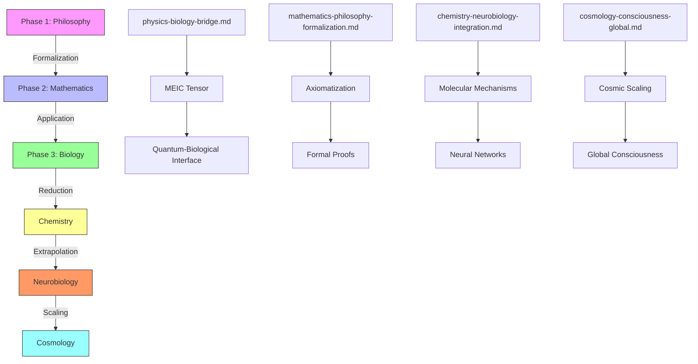
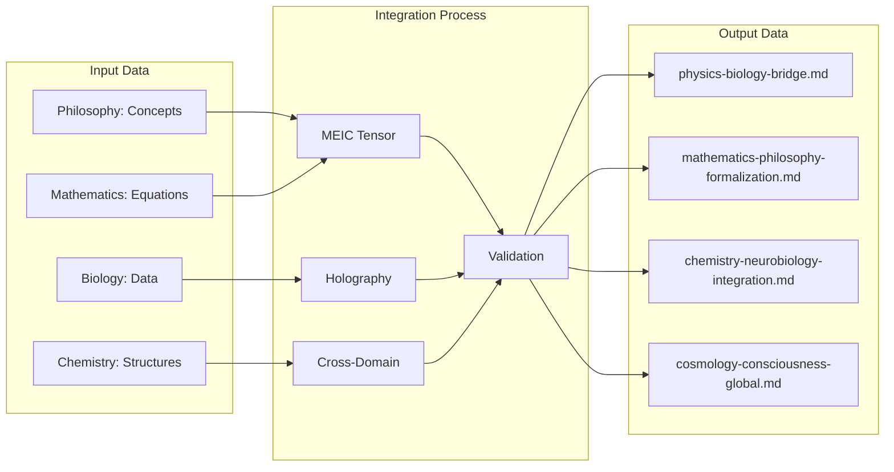
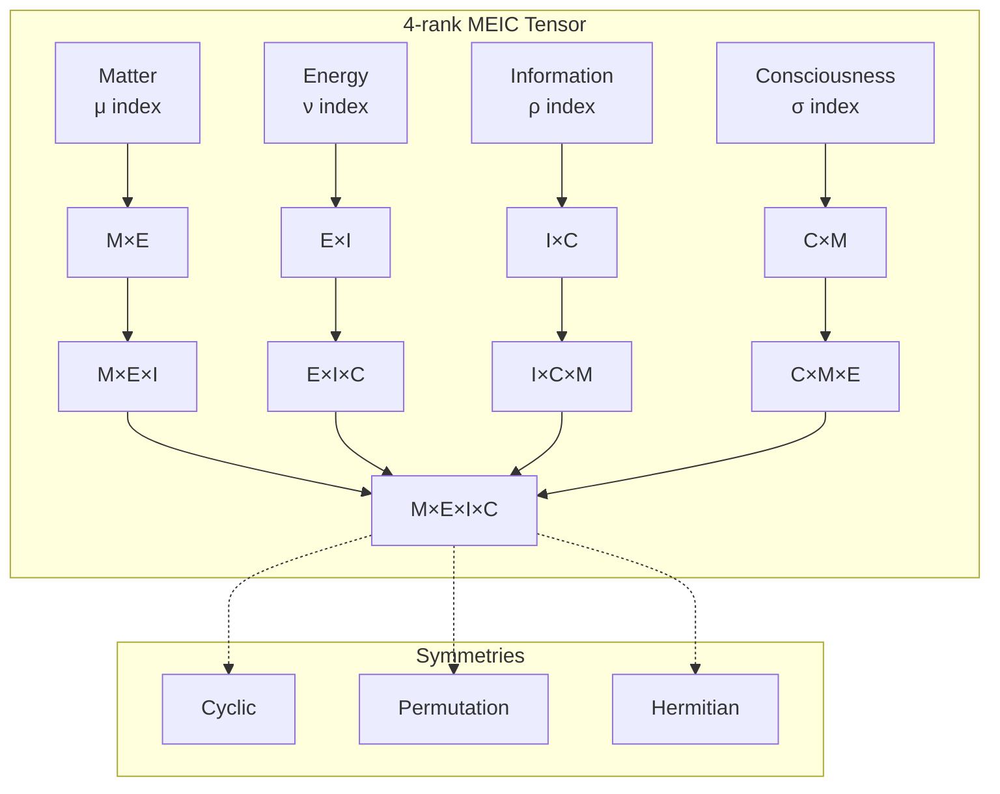
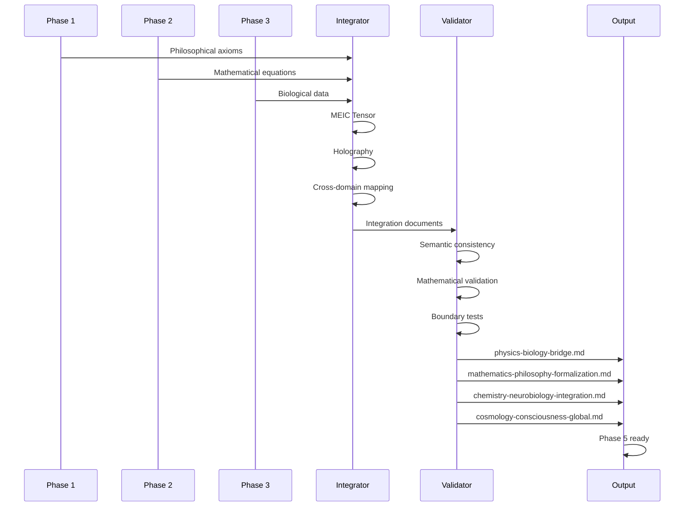
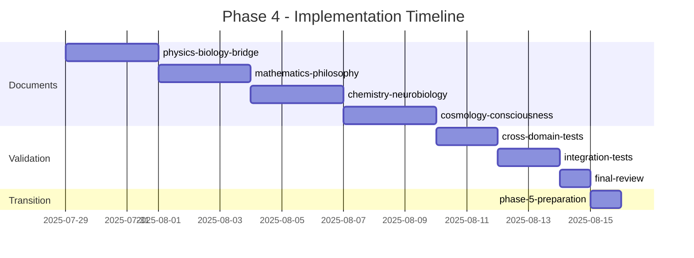
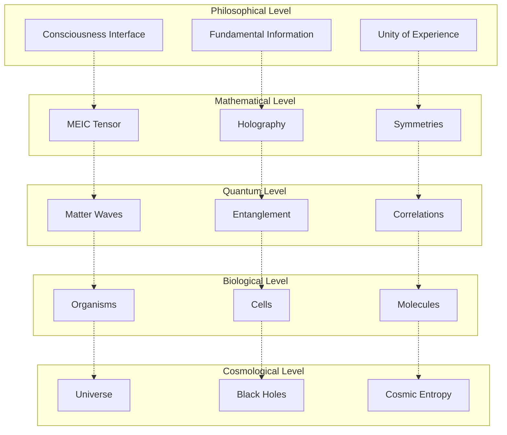
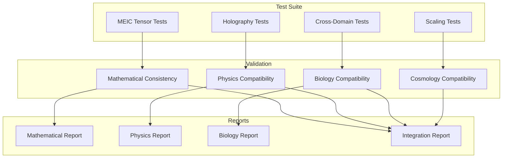

# Phase 4 Integration Diagrams - TSI 8.0

## Diagram 1: Cross-Domain Integration Architecture

## Diagram 2: Information Flow Between Domains

## Diagram 3: Synchronization Points

```mermaid
graph TD
    subgraph "Point A: Philosophy → Mathematics"
        A1[Philosophical Axioms]
        A2[Mathematical Formalization]
        A3[Validation]
        A1 --> A2 --> A3
    end
    
    subgraph "Point B: Mathematics → Physics"
        B1[MEIC Tensor]
        B2[Quantum Models]
        B3[Biological Translation]
        B1 --> B2 --> B3
    end
    
    subgraph "Point C: Physics → Biology"
        C1[Quantum Effects]
        C2[Biological Systems]
        C3[Testable Predictions]
        C1 --> C2 --> C3
    end
    
    subgraph "Point D: Biology → Chemistry"
        D1[Molecular Mechanisms]
        D2[Neural Networks]
        D3[System Integration]
        D1 --> D2 --> D3
    end
    
    subgraph "Point E: Chemistry → Neurobiology"
        E1[Chemical Reactions]
        E2[Neurotransmission]
        E3[Consciousness Interface]
        E1 --> E2 --> E3
    end
    
    subgraph "Point F: Neurobiology → Cosmology"
        F1[Brain Scale]
        F2[Cosmic Scale]
        F3[Global Consciousness]
        F1 --> F2 --> F3
    end
```

## Diagram 4: MEIC Tensor Structure

## Diagram 5: Cross-Domain Validation Process

## Diagram 6: Implementation Timeline

## Diagram 7: Abstraction Hierarchy

## Diagram 8: Integration Testing System

## Diagram Usage

### In implementation:
1. **Diagram 1**: Use to understand flow between phases
2. **Diagram 2**: Use to design data flow
3. **Diagram 3**: Use for synchronization points
4. **Diagram 4**: Use for MEIC tensor implementation
5. **Diagram 5**: Use for validation process
6. **Diagram 6**: Use for timeline management
7. **Diagram 7**: Use to understand hierarchy
8. **Diagram 8**: Use for testing system

### Implementation format:
- All diagrams are in Mermaid format
- Can be rendered in Markdown
- Compatible with GitHub and VS Code
- Can be exported to PNG/SVG