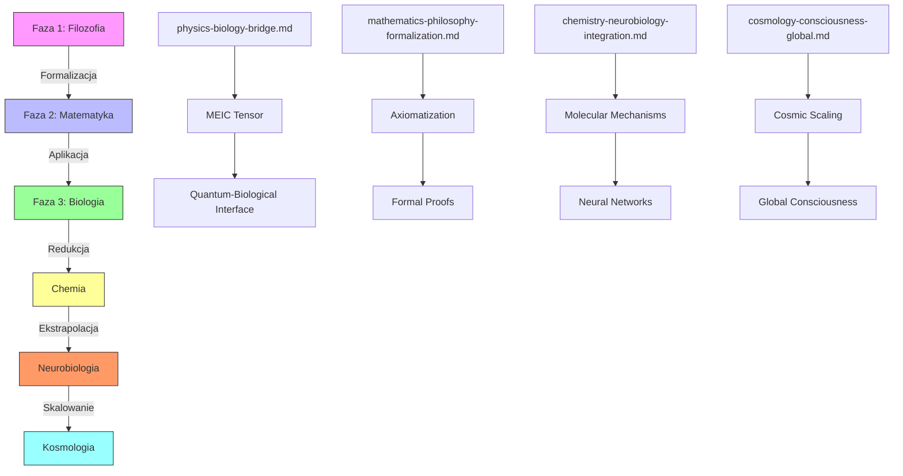
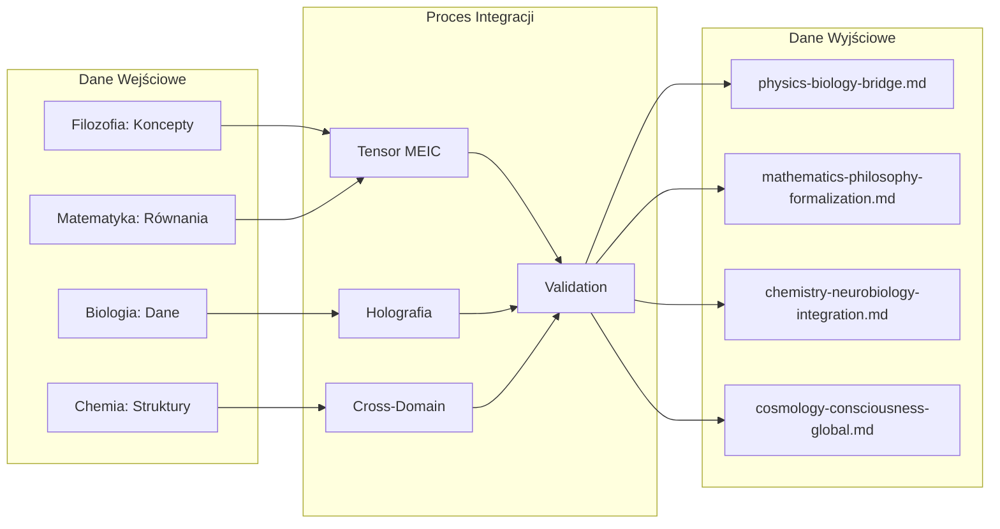
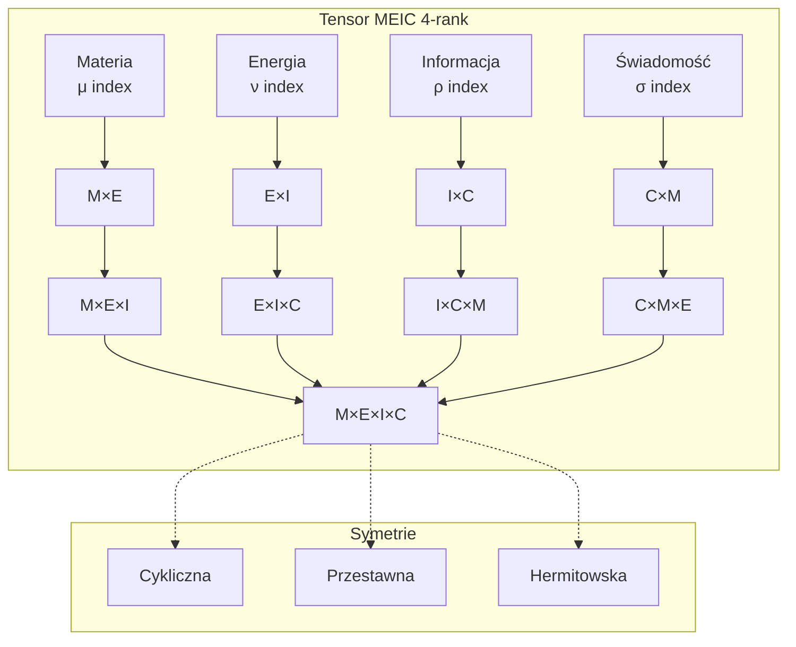
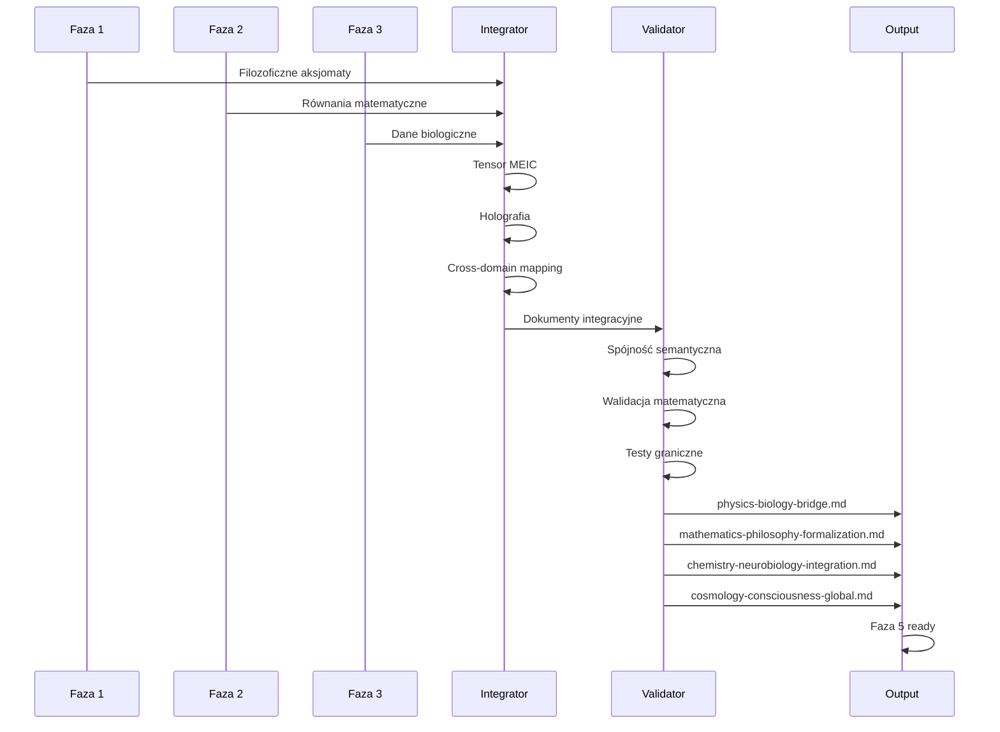
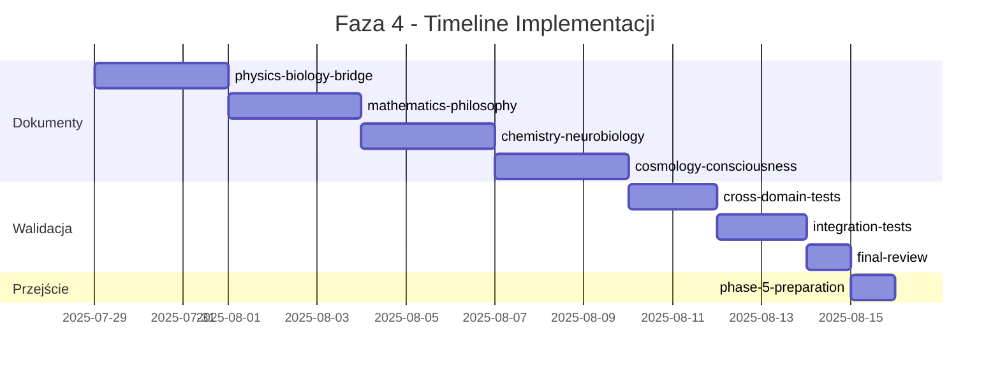
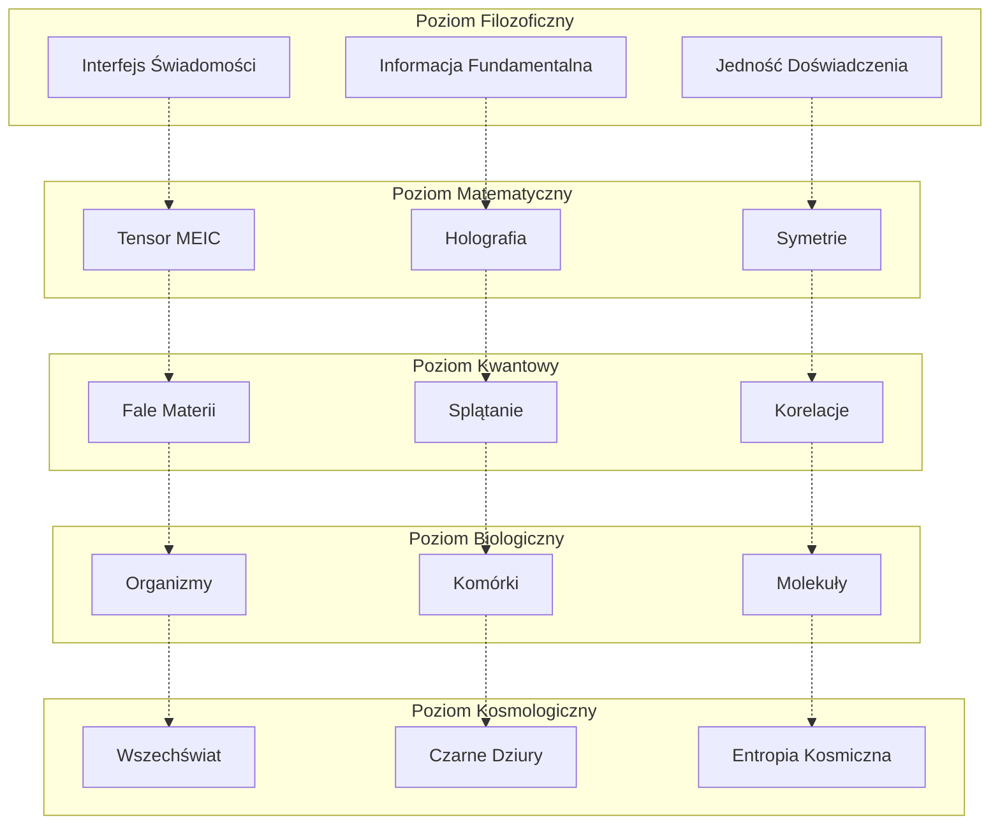
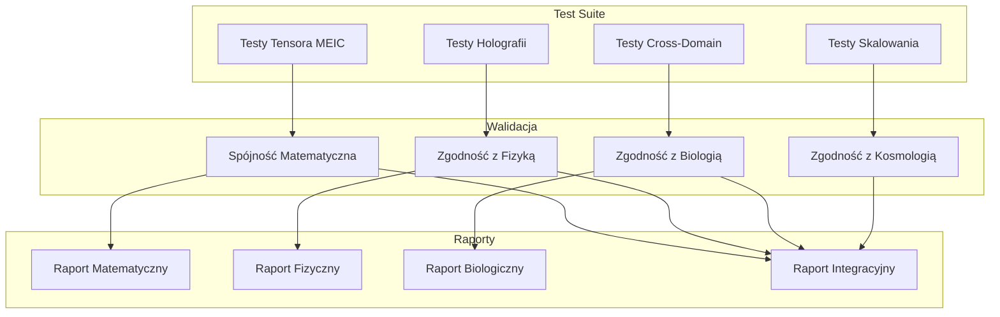

# Diagramy Integracyjne Fazy 4 - TSI 8.0

## Diagram 1: Architektura Integracji Cross-Domain

## Diagram 2: Przepływ Informacji Między Dziedzinami

## Diagram 3: Punkty Synchronizacji

```mermaid
graph TD
    subgraph "Punkt A: Filozofia → Matematyka"
        A1[Aksjomaty Filozoficzne]
        A2[Formalizacja Matematyczna]
        A3[Validation]
        A1 --> A2 --> A3
    end
    
    subgraph "Punkt B: Matematyka → Fizyka"
        B1[Tensor MEIC]
        B2[Quantum Models]
        B3[Biological Translation]
        B1 --> B2 --> B3
    end
    
    subgraph "Punkt C: Fizyka → Biologia"
        C1[Quantum Effects]
        C2[Biological Systems]
        C3[Testable Predictions]
        C1 --> C2 --> C3
    end
    
    subgraph "Punkt D: Biologia → Chemia"
        D1[Molecular Mechanisms]
        D2[Neural Networks]
        D3[System Integration]
        D1 --> D2 --> D3
    end
    
    subgraph "Punkt E: Chemia → Neurobiologia"
        E1[Chemical Reactions]
        E2[Neurotransmission]
        E3[Consciousness Interface]
        E1 --> E2 --> E3
    end
    
    subgraph "Punkt F: Neurobiologia → Kosmologia"
        F1[Brain Scale]
        F2[Cosmic Scale]
        F3[Global Consciousness]
        F1 --> F2 --> F3
    end
```

## Diagram 4: Struktura Tensora MEIC

## Diagram 5: Proces Walidacji Cross-Domain

## Diagram 6: Timeline Implementacji

## Diagram 7: Hierarchia Abstrakcji

## Diagram 8: System Testów Integracyjnych

## Użycie Diagramów

### W implementacji:
1. **Diagram 1**: Wykorzystaj do zrozumienia przepływu między fazami
2. **Diagram 2**: Wykorzystaj do projektowania przepływu danych
3. **Diagram 3**: Wykorzystaj do synchronizacji punktów
4. **Diagram 4**: Wykorzystaj do implementacji tensora MEIC
5. **Diagram 5**: Wykorzystaj do procesu walidacji
6. **Diagram 6**: Wykorzystaj do zarządzania timeline
7. **Diagram 7**: Wykorzystaj do zrozumienia hierarchii
8. **Diagram 8**: Wykorzystaj do systemu testów

### Format implementacji:
- Wszystkie diagramy są w formacie Mermaid
- Można je renderować w Markdown
- Kompatybilne z GitHub i VS Code
- Można eksportować do PNG/SVG